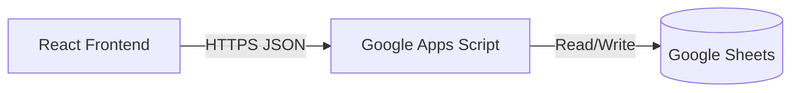

# 🧾 WesLedger

> **Status:** System v1.4 (Stable)  
> **Architecture:** Serverless / Sovereign  
> **Cost:** $0.00 / month

**WesLedger** is a lightweight, operator-grade personal financial intelligence system. It prioritizes **data sovereignty**, **manual awareness**, and **zero overhead** over automation and vendor lock-in.

Most financial apps are traps: they charge you a monthly subscription to sell your data to advertisers, while locking your transaction history inside a proprietary database you can't access.

**WesLedger is the antidote.**
- **Database:** Google Sheets (Free, Exportable, Owned by you).
- **Backend:** Google Apps Script (Serverless, Maintenance-free).
- **Frontend:** React + TypeScript (Fast, Modern, Local or Vercel-deployed).

---

## 🏗 System Architecture



The system uses a "Headless" approach where the logic lives in the browser, and Google Sheets acts as a dumb, reliable storage layer.

---

## 🚀 Deployment Protocol

### Phase 1: The Vault (Google Sheets)

1. Create a new **Google Sheet**.
2. Rename the sheet (tab) at the bottom to `ledger`. **(Case sensitive)**.
3. Create the following headers in **Row 1**:

| Col A | Col B | Col C | Col D | Col E | Col F |
|-------|-------|-------|-------|-------|-------|
| date | description | amount | category | createdAt | id |

4. **Formatting Tips:**
   - Select Column A -> Format > Number > Plain Text (keeps dates consistent).
   - Select Column C -> Format > Number > Currency.

### Phase 2: The Gateway (Google Apps Script)

1. inside your Google Sheet, go to **Extensions > Apps Script**.
2. Rename the project to `WesLedger API`.
3. Clear the default code in `Code.gs` and replace it with the **Backend Code** found in `services/ledgerService.ts` of this repository.
4. Click **Deploy > New Deployment**.
   - **Select type:** Web app.
   - **Description:** `v1`.
   - **Execute as:** `Me` (your email).
   - **Who has access:** `Anyone` (Important: This allows the React app to hit the API without OAuth complexity. Security is handled by the secrecy of the URL).
5. Copy the **Web App URL** (ends in `/exec`).

### Phase 3: The Interface (Frontend)

1. Clone this repository.
2. Install dependencies:
   ```bash
   npm install
   ```
3. Start the local server:
   ```bash
   npm start
   ```
4. When the app loads, click the **Config** button in the top right.
5. Switch Mode to **LIVE**.
6. Paste your **Web App URL** from Phase 2.
7. Click **Save Configuration**.

---

## 🛡 Security Philosophy

This system relies on **Security by Obscurity** for the API endpoint. 
- The API URL acts as your "Private Key". 
- Do not share the URL publicly.
- Because the script runs as "Me" (You), only your script has permission to edit your sheet, but the "Anyone" access allows the standard `fetch` request from the browser to trigger it.

---

## ⚡ Features

- **Full CRUD:** Create, Read, Update, Delete transactions.
- **Real-time Metrics:** Instant calculation of Balance, Income, and Expense.
- **Search & Filter:** Instant local filtering by keyword or category.
- **Export:** One-click CSV export of your current view.
- **Demo Mode:** Works offline with LocalStorage for testing.

---

## 🔮 Future Roadmap

- [ ] **Data Visualization:** Monthly trend lines and category pie charts.
- [ ] **Budget Envelopes:** Set limits per category.
- [ ] **AI Analysis:** Integration with LLMs to query the sheet (e.g., "How much did I spend on coffee in 2023?").

---

*"Own your ledger, own your life."*
