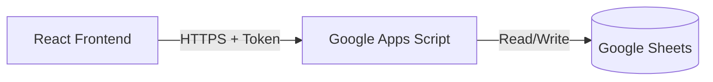

# WesLedger

> **Status:** System v1.7 (Secure)
> **Architecture:** Serverless / Sovereign
> **Cost:** $0.00 / month

**WesLedger** is a lightweight, operator-grade personal financial intelligence system. It prioritizes **data sovereignty**, **manual awareness**, and **zero overhead** over automation and vendor lock-in.

Most financial apps are traps: they charge you a monthly subscription to sell your data to advertisers, while locking your transaction history inside a proprietary database you can't access.

**WesLedger is the antidote.**
- **Database:** Google Sheets (Free, Exportable, Owned by you).
- **Backend:** Google Apps Script (Serverless, Maintenance-free).
- **Frontend:** React + TypeScript (Fast, Modern, Local or Vercel-deployed).

---

## System Architecture



The system uses a "Headless" approach where the logic lives in the browser, and Google Sheets acts as a dumb, reliable storage layer.

---

## Deployment Protocol

### Phase 1: The Vault (Google Sheets)

1. Create a new **Google Sheet**.
2. Rename the sheet (tab) at the bottom to `ledger`. **(Case sensitive)**.
3. Create the following headers in **Row 1**:

| Col A | Col B | Col C | Col D | Col E | Col F |
|-------|-------|-------|-------|-------|-------|
| date | description | amount | category | createdAt | id |

4. **Formatting Tips:**
   - Select Column A -> Format > Number > Plain Text (keeps dates consistent).
   - Select Column C -> Format > Number > Currency.

### Phase 2: The Gateway (Google Apps Script)

1. Inside your Google Sheet, go to **Extensions > Apps Script**.
2. Rename the project to `WesLedger API`.
3. **Get the Code:**
   - Open the WesLedger Web App (this repo running locally).
   - Click **Config** > **Backend Code**.
   - Copy the script.
4. Paste it into `Code.gs` in the Google Script editor.
5. **CRITICAL:** Change the `API_SECRET` variable at the top of the file to a strong password.
6. Click **Deploy > New Deployment**.
   - **Select type:** Web app.
   - **Description:** `v1`.
   - **Execute as:** `Me` (your email).
   - **Who has access:** `Anyone` (This allows the React app to hit the endpoint; security is handled by your API Token).
7. Copy the **Web App URL** (ends in `/exec`).

### Phase 3: The Interface (Frontend)

1. Clone this repository.
2. Install dependencies:
   ```bash
   npm install
   ```
3. Start the local server:
   ```bash
   npm start
   ```
4. When the app loads, click the **Config** button in the top right.
5. Switch Mode to **LIVE**.
6. Paste your **Web App URL** from Phase 2.
7. Paste your **API Secret Token** (the password you set in step 2.5).
8. Click **Save Configuration**.

---

## Security Philosophy

**System v1.7** uses **Bearer Token Authentication**.

- **The Lock:** The Google Apps Script checks every request for a valid `token`.
- **The Key:** Your React App stores this token in your browser's LocalStorage.
- **The Protocol:** Even if someone discovers your API URL, they cannot read or write data without the Token.

---

## Features

- **Full CRUD:** Create, Read, Update, Delete transactions.
- **Real-time Metrics:** Instant calculation of Balance, Income, and Expense.
- **Search & Filter:** Instant local filtering by keyword or category.
- **Bulk Operations:** Batch delete filtered entries with strict confirmation.
- **Analytics:** Visual trend lines and expense categorization.
- **Export:** One-click CSV export of your current view.
- **Demo Mode:** Works offline with LocalStorage for testing.
- **Command Center:** Get your backend deployment code directly from the UI.

---

## Future Roadmap

- [ ] **Budget Envelopes:** Set limits per category.
- [ ] **AI Analysis:** Integration with LLMs to query the sheet (e.g., "How much did I spend on coffee in 2023?").

---

*"Own your ledger, own your life."*